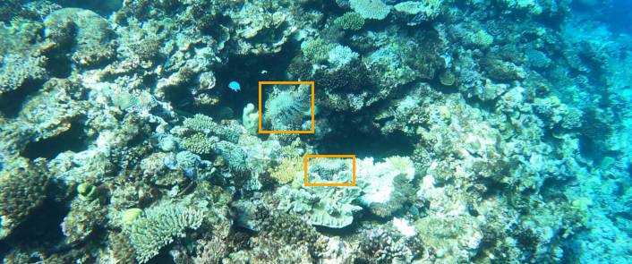
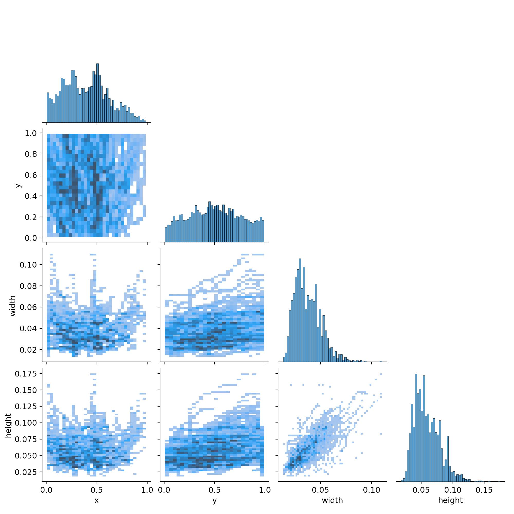
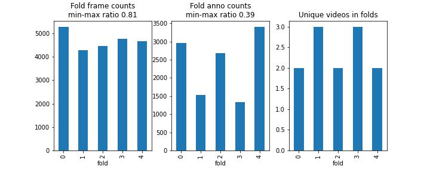

# Reef protection



### Detect starfish in real-time on underwater videos of coral reefs.

The Great Barrier Reef is under threat, in part because of the overpopulation of one particular starfish – the coral-eating crown-of-thorns starfish (or COTS for short). To know where the COTS are, a traditional reef survey method, called "Manta Tow", is performed by a snorkel diver. While towed by a boat, they visually assess the reef. This method faces clear limitations, including operational scalability, data resolution, reliability, and traceability.

To scale up video-based surveying systems, Australia’s national science agency, CSIRO has teamed up with Google to develop innovative machine learning technology that can analyse large image datasets accurately, efficiently, and in near real-time. This is a solution codebase for the challenge.

## Data statistics

- Video size : 1280 x 720
- 3 video sets including 20 sequences
- 20.9 % of all video frames are annotated

#### Starfish bounding box statistics


__________________________________________

## Install Python environment

See [instructions](INSTALL.md)

## Training models

### 1. Split the video sequences into five cross-validation folds

There are 3 videos that have 20 sequences in total. Some of the sequences don't have any starfish and some have over 3000. Also, the frame count varies between sequences.

Split the data into five folds where frames in one sequence always belong to the same fold while having as balanced annotation and frame count in all folds as possible.

Run:

```bash
python src/split_folds.py
```

This saves `./input/train_folds.csv` which is a copy of train.csv with additional fold column.

##### Fold split stats




### 2. YOLOv5

For [Weights&Biases](wandb.ai) logging, install wandb `pip install wandb` and login to your profile `wandb login`. Set your username to ENTITY in [configs/wandb.config](configs/wandb.config).

#### 2.1 Prepare dataset

Yolo requires training images and annotations in certain form. Running this python script symlinks images to `input/yolo_ds/images/` folder, creates annotation files to `input/yolo_ds/labels/`, and prepares CV-fold training yaml configs to `input/yolo_ds/`.

```bash
python src/create_yolo_ds.py
```

#### 2.2 Train fold models
