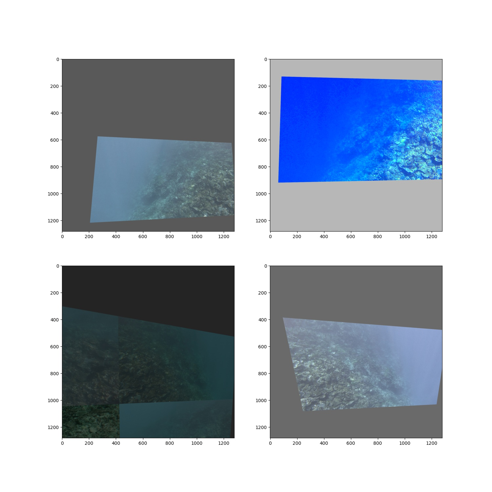
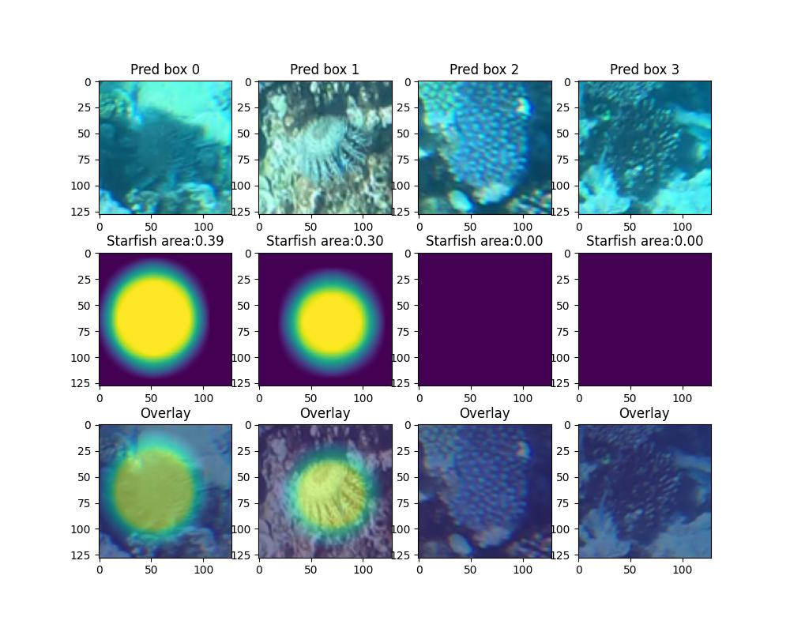
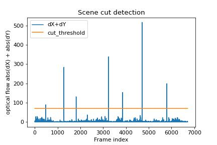

# Reef protection


### Detect starfish in real-time on underwater videos of coral reefs.

The Great Barrier Reef is under threat, in part because of the overpopulation of one particular starfish – the coral-eating crown-of-thorns starfish (or COTS for short). To know where the COTS are, a traditional reef survey method, called "Manta Tow", is performed by a snorkel diver. While towed by a boat, they visually assess the reef. This method faces clear limitations, including operational scalability, data resolution, reliability, and traceability.

To scale up video-based surveying systems, Australia’s national science agency, CSIRO has teamed up with Google to develop innovative machine learning technology that can analyse large image datasets accurately, efficiently, and in near real-time. This is a solution codebase for the challenge.

## Data statistics

- Video size : 1280 x 720
- 3 video sets including 20 sequences
- 20.9 % of all video frames are annotated

#### Starfish bounding box statistics


__________________________________________

## Install Python environment

See [instructions](INSTALL.md)

## Training models

### 1. Split the video sequences into five cross-validation folds

There are 3 videos that have 20 sequences in total. Some of the sequences don't have any starfish and some have over 3000. Also, the frame count varies between sequences.

Split the data into five folds where frames in one sequence always belong to the same fold while having as balanced annotation and frame count in all folds as possible.

Run:

```bash
python src/split_folds.py
```

This saves `./input/train_folds.csv` which is a copy of train.csv with additional fold column.

##### Fold split stats


### 2. YOLOv5

For [Weights&Biases](wandb.ai) logging, install wandb `pip install wandb` and login to your profile `wandb login`. Set your username to ENTITY in [configs/wandb.config](configs/wandb.config).

#### YOLO metric to competition metric

See [instructions](YOLO_METRIC.md) to modify yolo metrics to competition metrics.

#### 2.1 Prepare dataset

Yolo requires training images and annotations in certain form. Running this python script symlinks images to `input/yolo_ds/images/` folder, creates annotation files to `input/yolo_ds/labels/`, and prepares CV-fold training yaml configs to `input/yolo_ds/`.

The number of background samples (frames without annotations) is reduced to avoid saturating training with negative samples. Training set BG sample percentage is kept at ~10% (random subsets) but all samples are kept for validation folds.

```bash
python src/create_yolo_ds.py
```

#### 2.2 Train fold models

```bash
sh train_yolo.sh
```

You may tune [augmentation parameters](./configs/hyp.reef-aug.yaml) and check the results by running `python ./src/tests/test_yolov5_aug.py`



##### Onnx

After training, models can be export to onnx. However, I didn't manage to get same inference speed with onnx as with original models. Example conversion script that outputs `best.onnx` model.

```python
python ./yolov5/export.py --weights "./yolov5/reef/3000_fold3_yolov5m-20ep3/weights/best.pt" --include onnx --dynamic

# optimization, saves "_opt.onnx" and "_quant.onnx" models
ptyhon src/optimize_onnx.py --onnx_pth="./yolov5/reef/3000_fold3_yolov5m-20ep3/weights/best.onnx"
```

##### Evaluate

To evaluate model on competition F2 metric, you may run:

```bash
FOLD=3
THRESHOLD=0.2
IM_SIZE=3000
YOLO_PTH="./yolov5/reef/3000_fold3_yolov5m-20ep3/weights/best.pt"

python src/evaluate_yolo.py \
    --fold=$FOLD \
    --yolo_pth=$YOLO_PTH \
    --im_size=$IM_SIZE \
    --threshold=$THRESHOLD
```

### 3. Box validator

Starfish detection crop segmentation model is used to filter out some of the false positive detections. We train a model to segment starfish ellipses from the detected crops. All predictions are resized (linear interpolation) to 128x128 rgb boxes.



#### Create segmentation dataset

To ensure the model is trained with difficult enough samples, we generate the dataset directly from Yolo model validation fold predictions. Detection threshold should be tuned for each fold model such that we get 50% of FP detections and 50% of TP predictions.

Yolo dataset (step 2.1) is a prerequisite for this step. To generate data, run with each fold model separately:

```shell
FOLD=2
THRESHOLD=0.2
IM_SIZE=3000
YOLO_PTH="./yolov5/reef/3000_fold2_yolov5m-20ep2/weights/best.pt"

python src/create_segmentation_ds.py \
    --fold=$FOLD \
    --yolo_pth=$YOLO_PTH \
    --im_size=$IM_SIZE \
    --threshold=$THRESHOLD
```

## Additional modules

### Scene cut detection

The video files contain multiple sequences and it's important to know when a scen cut happens to reset tracking. File name indices are good indication in the training set (e.g. gap between image 123.jpg and 200.jpg) but we cannot rely on this in private test.

Thus, I wrote a simple scene cut detection module `SceneCutDetector` that uses estimated motion changes to detect inconsistent optical flow.

`python src/tests/test_scenecut_detector.py`

