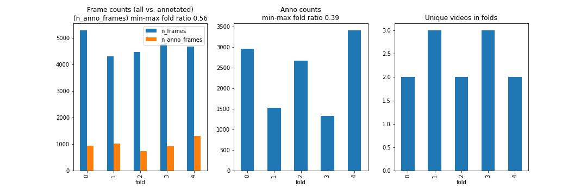

# Reef protection

## Install

Install and activate conda env.

```bash
conda create -n reef --yes python=3.8 jupyter
conda activate reef

conda install -c conda-forge --yes cudnn
conda install pytorch torchvision torchaudio cudatoolkit=11.3 -c pytorch
```

Install submodules (yolov5)

```bash
git submodule init && git submodule update

cd yolov5 && pip install -r requirements.txt
```

Install additional dependencies

```
pip install -r requirements.txt
```

Download [competition data](https://www.kaggle.com/c/tensorflow-great-barrier-reef/data) and place it into `input` folder according to Folder structure below.  

### Folder & file structure
```
root
|_input                  (training data - gitignored)
|  |_tensorflow-great-barrier-reef
|    |_...
|_configs                (configuration files)
|  |_wandb_params.json   (wandb logging config)
|  |_...
|media                   (images etc.)
|  |_...
|_notebooks              (jupyter notebooks)
|  |_...
|_src                    (python files)
|  |_...
|_...
```

_____________________________

## Training models

### 1. Split the video sequences into five cross-validation folds

There are 3 videos that have 20 sequences in total. Some of the sequences don't have any starfish and some have over 3000. Also, the frame count varies between sequences.

Split the data into five folds where frames in one sequence always belong to the same fold while having as balanced annotation and frame count in all folds as possible.

Run:

```bash
python src/split_folds.py
```

This saves `./input/train_folds.csv` which is a copy of train.csv with additional fold column.

##### Fold split stats




### 2. YOLOv5

#### 2.1 Prepare dataset

Yolo requires training images and annotations in certain form. Running this python script symlinks images to `input/yolo_ds/images/` folder, creates annotation files to `input/yolo_ds/labels/`, and prepares CV-fold training yaml configs to `input/yolo_ds/`.

```bash
python src/create_yolo_ds.py
```

#### 2.2 Train fold models
